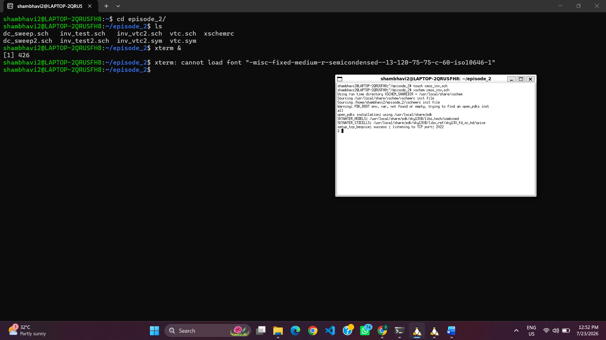
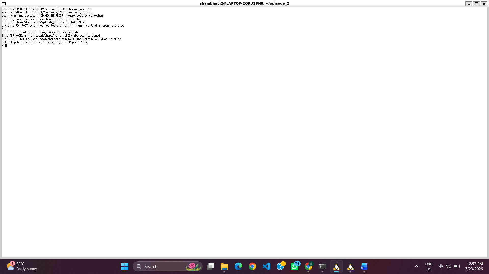
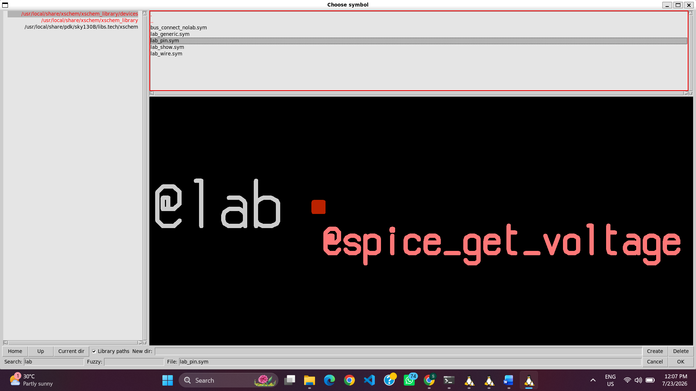
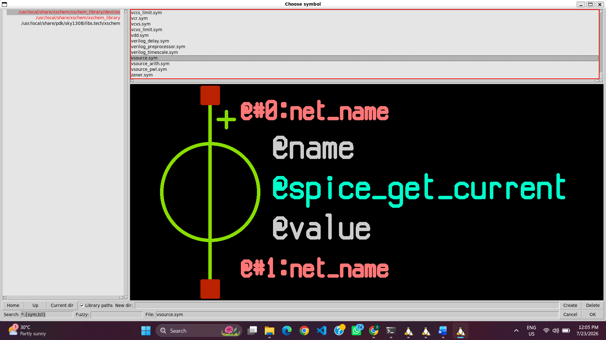
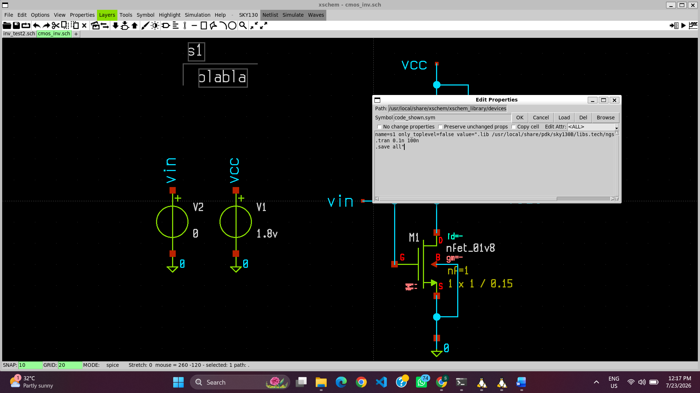
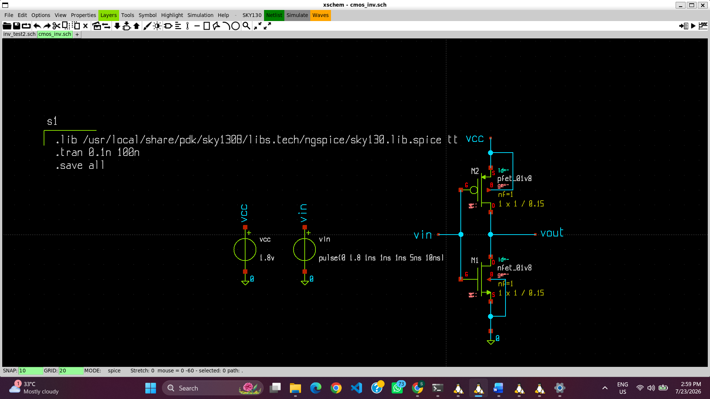

# 01 – CMOS Inverter Design and Transient Analysis

## Objective

Design a CMOS inverter using the Sky130 Open-Source PDK in Xschem and verify its switching behavior through transient simulation using NgSpice.

---

## Design Flow

### Step 1: Project Creation

A dedicated project directory was created to organize all design files. The Sky130 `xschemrc` configuration file was copied into the project folder to enable access to the Sky130 PDK libraries and simulation models.

| Project Directory | Launching Xschem |
| :---------------: | :--------------: |
|  |  |

---

### Step 2: CMOS Inverter Schematic Design

The CMOS inverter was implemented by selecting one PMOS and one NMOS transistor from the Sky130 device library. Appropriate lab pins were added for **VDD**, **GND**, **VIN**, and **VOUT**, and the transistors were interconnected to form the inverter circuit.

#### Selecting the MOSFET Devices

| PMOS | NMOS |
| :--: | :--: |
|  |  |

#### Adding Lab Pins

---

### Step 3: Simulation Configuration

A pulse voltage source was connected to the input of the inverter to generate alternating logic levels. A transient analysis command was added to the schematic to observe the output response over time.

---

#### Completed CMOS Inverter Schematic

The completed schematic includes:

- PMOS pull-up network
- NMOS pull-down network
- Input (VIN)
- Output (VOUT)
- Power supply (VDD)
- Ground (GND)

---

### Step 4: Netlist Generation

After verifying the schematic connections, Xschem generated the SPICE netlist required for simulation. The generated netlist contains the circuit connectivity, transistor models, voltage sources, and simulation commands used by NgSpice.

---

### Step 5: Running the Simulation

The generated netlist was simulated using NgSpice. The simulator successfully executed the transient analysis and produced the voltage waveforms for the input and output nodes.

---

### Step 6: Transient Analysis

The transient response of the CMOS inverter was plotted by displaying **VIN** and **VOUT** on the same graph.

The waveform demonstrates the expected operation of the CMOS inverter:

- When **VIN** is LOW (0 V), the PMOS transistor turns ON and the NMOS transistor turns OFF, causing **VOUT** to rise to approximately **1.8 V**.
- When **VIN** is HIGH (1.8 V), the NMOS transistor turns ON and the PMOS transistor turns OFF, pulling **VOUT** down to **0 V**.
- The output waveform is the logical complement of the input waveform.
- A small propagation delay is visible during each transition due to the charging and discharging of the output capacitance.

---

## Conclusion

This section demonstrates the complete design flow of a CMOS inverter using the Sky130 Open-Source PDK. The inverter schematic was successfully created in Xschem, simulated using NgSpice, and verified through transient analysis. The obtained VIN–VOUT waveform confirms correct inverter functionality and provides the foundation for further analyses such as Voltage Transfer Characteristics (VTC), noise margins, propagation delay, power consumption, and physical layout in the subsequent modules.
