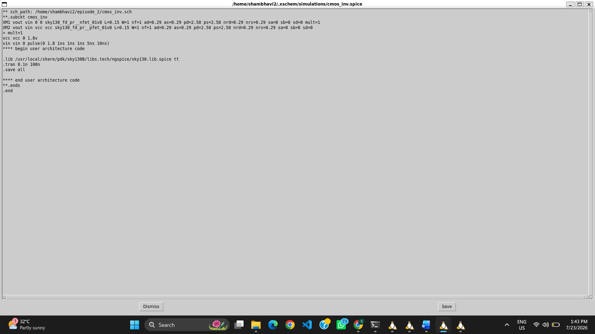
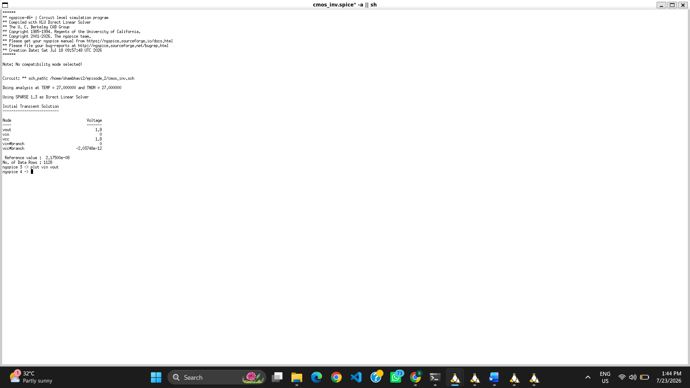

# 01 – CMOS Inverter Design and Transient Analysis

## Objective

Design a CMOS inverter using the Sky130 PDK in Xschem and verify its transient behavior using NgSpice.

---

## Step 1: Creating the Project Workspace

A new project directory was created, the Sky130 `xschemrc` configuration file was copied, and Xschem was launched.

| Project Setup | Launching Xschem |
|:-------------:|:----------------:|
|  |  |

---

## Step 2: CMOS Inverter Schematic Design

The PMOS and NMOS transistors were selected from the Sky130 device library, and the required lab pins were added to build the CMOS inverter schematic.

### Selecting PMOS and NMOS Devices

| PMOS | NMOS |
|:----:|:----:|
|  |  |

### Adding Lab Pins

### Completed Schematic

---

## Step 3: Configuring the Simulation

A pulse voltage source and transient simulation parameters were added to the schematic.

---

## Step 4: Generating the Netlist

The CMOS inverter schematic was converted into a SPICE netlist for simulation.

---

## Step 5: Running the Simulation

The generated netlist was executed successfully in NgSpice.

---

## Step 6: Transient Analysis

The transient response of the CMOS inverter was obtained by plotting the input voltage (**VIN**) and output voltage (**VOUT**).

---

## Observation

The transient simulation confirms the correct operation of the CMOS inverter.

- The output (**VOUT**) is the logical inversion of the input (**VIN**).
- When **VIN = 0 V**, **VOUT ≈ 1.8 V**.
- When **VIN = 1.8 V**, **VOUT ≈ 0 V**.
- A small propagation delay is observed due to the charging and discharging of the output capacitance.
- The inverter exhibits rail-to-rail output, demonstrating correct CMOS switching behavior.
