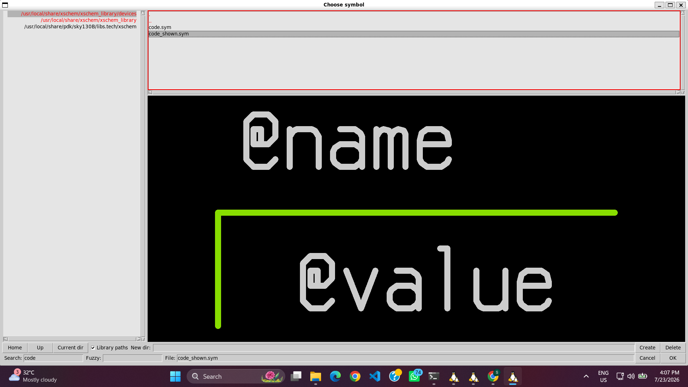
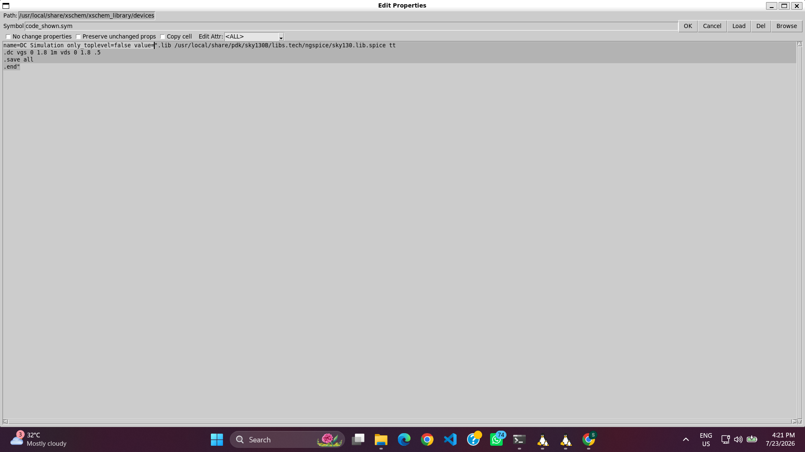
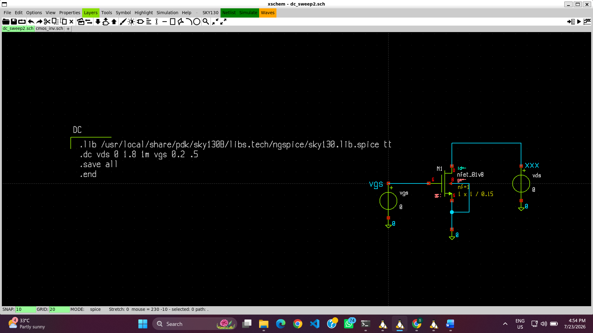
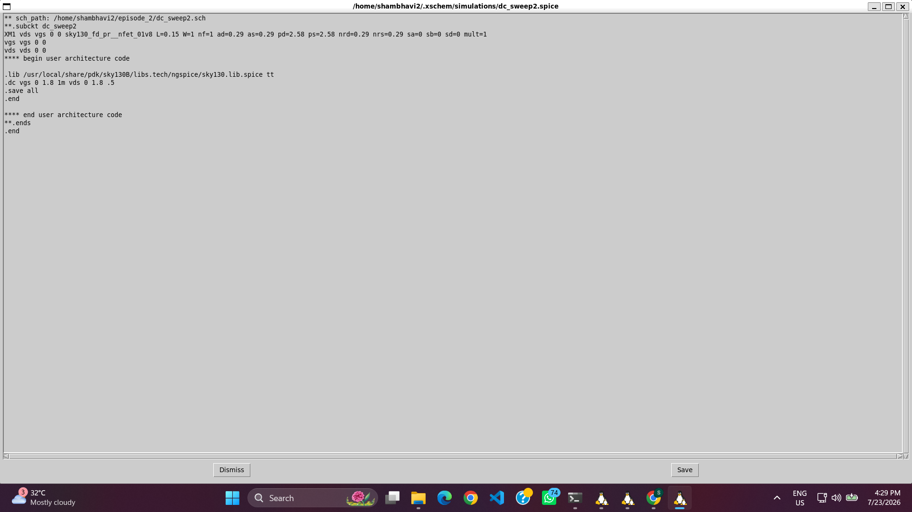
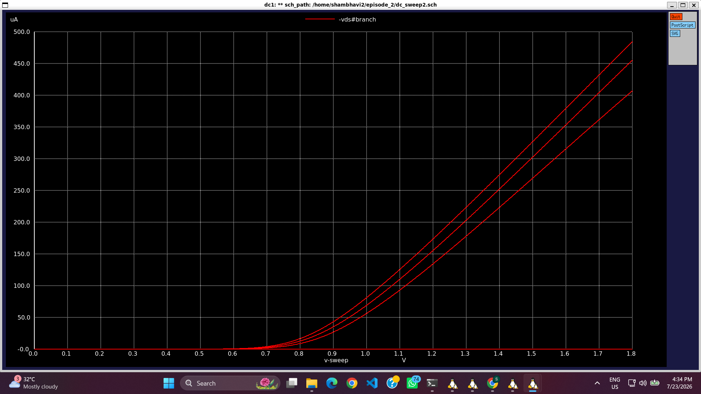
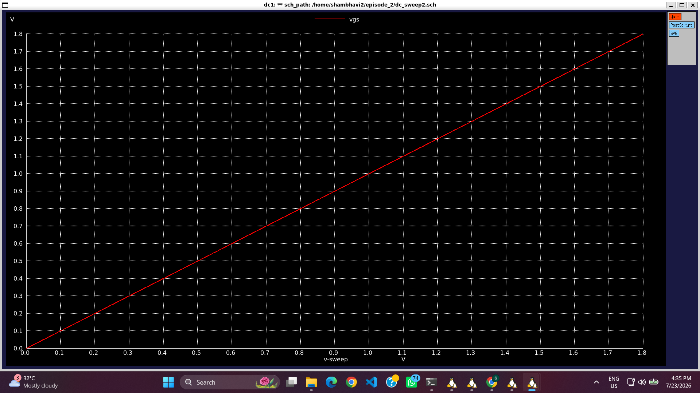

# 02 – NMOS Characterization Using DC Sweep Analysis

## Objective

Characterize the electrical behavior of the Sky130 NMOS transistor by performing DC sweep simulations using Xschem and NgSpice. The objective is to study the variation of drain current (IDS) with different values of gate-source voltage (VGS) and drain-source voltage (VDS).

---

## Design Flow

### Step 1: Project Creation

A new project workspace was created for NMOS characterization. The Sky130 PDK configuration was loaded, and Xschem was launched to begin the schematic design.

---

### Step 2: NMOS Test Circuit Design

A test circuit was created by placing a single NMOS transistor from the Sky130 device library. Voltage sources were added to bias the transistor, and lab pins were assigned for proper node identification.

#### Selecting the NMOS Device

#### Adding the Voltage Source

#### Adding Lab Pins

---

### Step 3: Simulation Configuration

A **code_show.sym** block was inserted into the schematic to define the simulation commands and include the Sky130 transistor model library.

#### Creating the Simulation Code Block

The simulation setup includes:

- Sky130 model library
- DC sweep command
- Save statements
- End statement

#### Completed NMOS Test Schematic

After placing the transistor, voltage sources, and lab pins, the complete NMOS characterization circuit was prepared for simulation.

---

### Step 4: Netlist Generation

After verifying all circuit connections, the SPICE netlist was generated successfully. The generated netlist contains the transistor model, voltage sources, circuit connectivity, and simulation commands required by NgSpice.

---

### Step 5: Running the Simulation

The generated netlist was simulated using NgSpice. The simulator successfully executed the DC sweep analysis for different values of **VGS** and **VDS**.

---

### Step 6: NMOS DC Characteristics

The drain current characteristics of the NMOS transistor were analyzed using DC sweep simulations.

#### IDS–VDS Characteristics for Different VGS

The drain current was plotted against **VDS** for multiple gate voltages. The family of curves illustrates the transition from the linear region to the saturation region as the drain voltage increases.

#### IDS–VGS Characteristics

The drain current was also plotted as a function of **VGS**, showing the increase in current as the gate voltage exceeds the threshold voltage.

---

## Observation

The DC sweep simulation successfully demonstrates the operating characteristics of the Sky130 NMOS transistor.

- The drain current increases with increasing gate-source voltage (VGS).
- For a fixed VGS, the drain current initially increases linearly with VDS before entering saturation.
- Higher values of VGS produce higher drain currents.
- The simulated characteristics closely follow the expected theoretical behavior of a long-channel MOSFET.

---

## Conclusion

The Sky130 NMOS transistor was successfully characterized using DC sweep analysis in Xschem and NgSpice. The obtained IDS–VDS and IDS–VGS characteristics validate the transistor's operating regions and provide a strong foundation for subsequent analyses, including CMOS inverter voltage transfer characteristics (VTC), noise margin, delay analysis, power analysis, and layout design.
