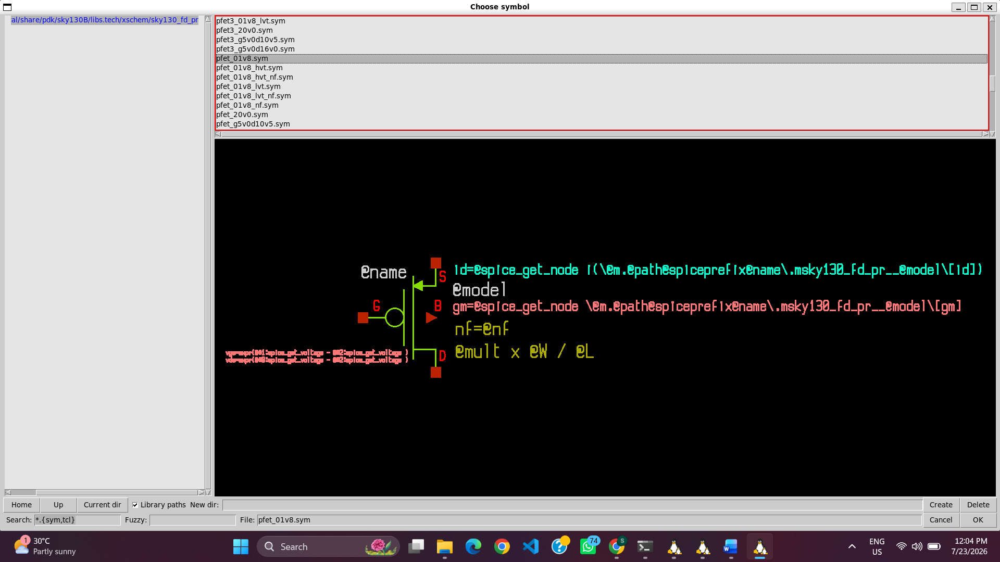
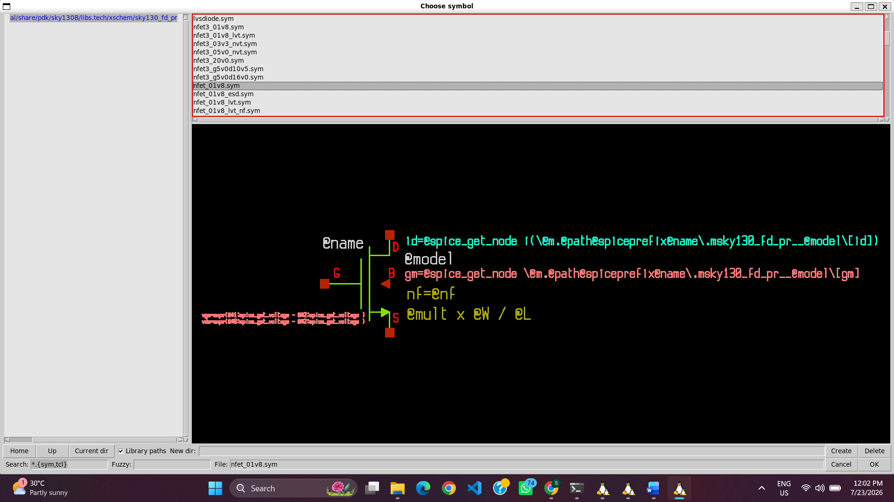
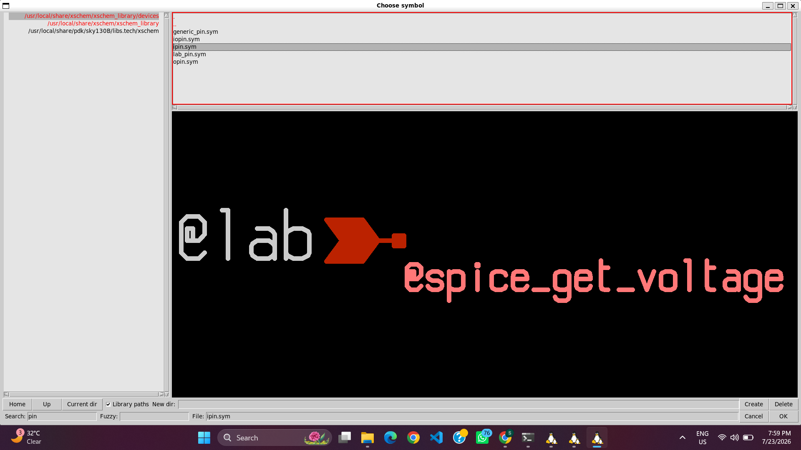
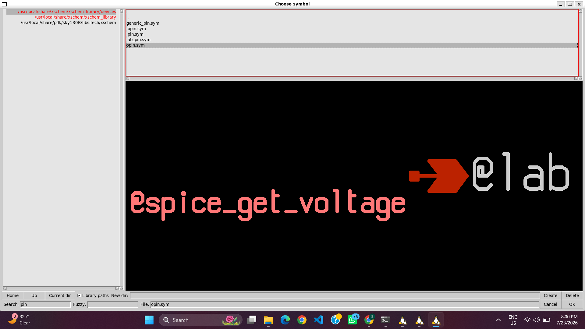
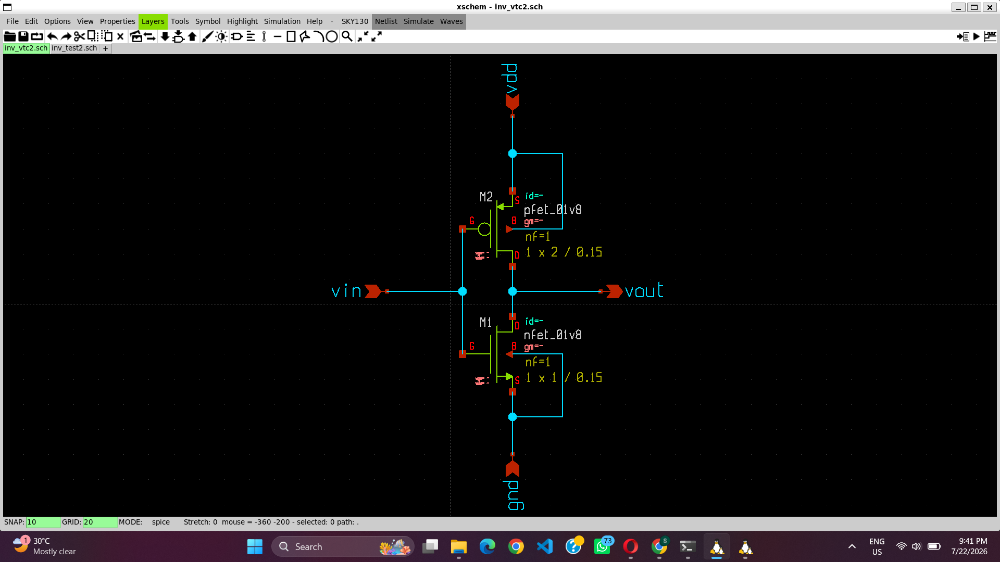
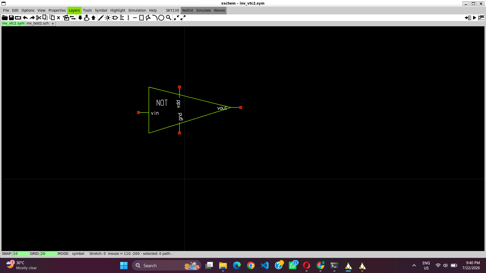
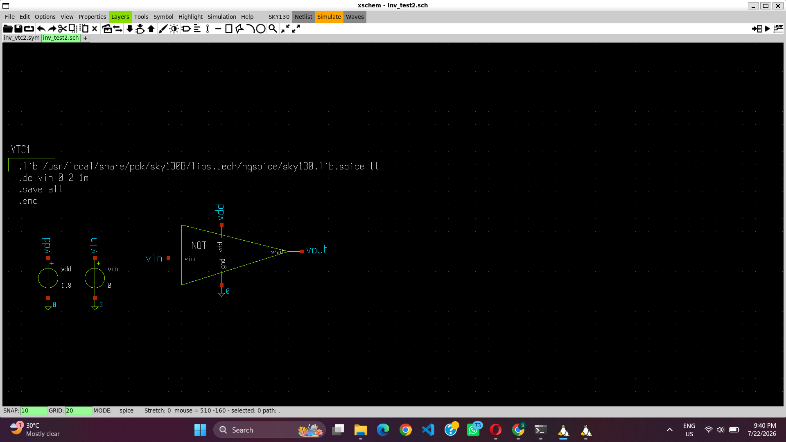
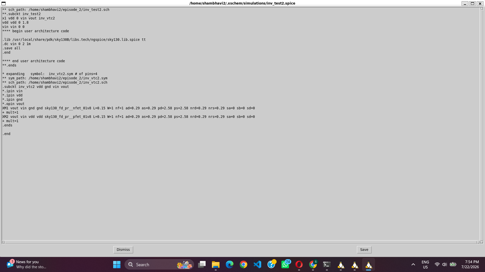
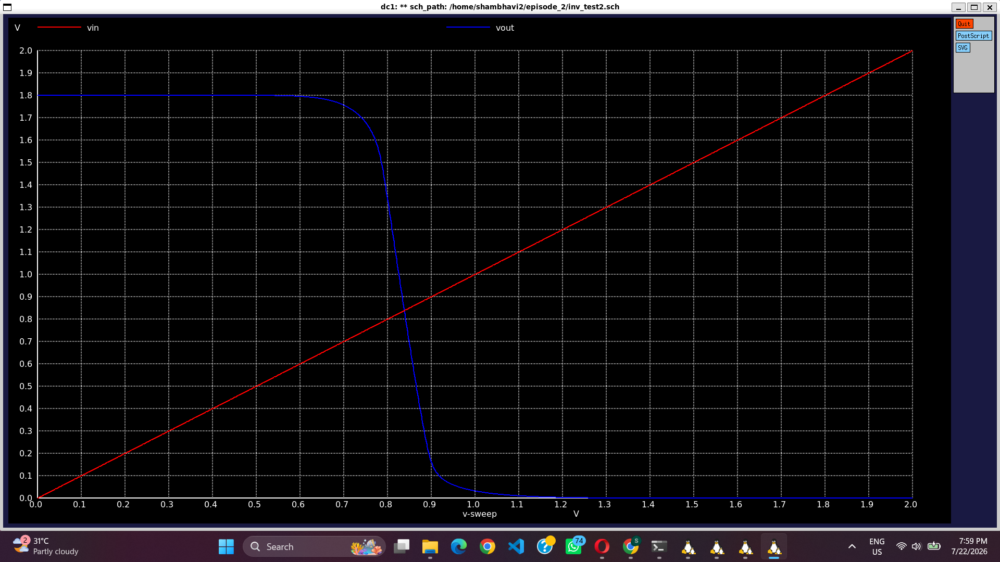

# 03 – CMOS Inverter Symbol Creation and Voltage Transfer Characteristics (VTC) Analysis

## Objective

Design a CMOS inverter, create its reusable symbol, build a testbench, and perform DC sweep simulation to obtain the Voltage Transfer Characteristics (VTC) using the Sky130 Open-Source PDK.

---

## Design Flow

### Step 1: CMOS Inverter Schematic Design

A CMOS inverter schematic was created in Xschem using one PMOS transistor and one NMOS transistor from the Sky130 device library. Input and output pins were added to make the design reusable for hierarchical circuits.

#### Selecting the MOSFET Devices

| PMOS | NMOS |
|------|------|
|  |  |

#### Creating Input and Output Pins

| Input Pin | Output Pin |
|-----------|------------|
|  |  |

#### Completed CMOS Inverter Schematic

The completed schematic consists of:

- PMOS pull-up transistor
- NMOS pull-down transistor
- Input pin (VIN)
- Output pin (VOUT)
- Power supply (VDD)
- Ground (GND)

---

## Step 2: Symbol Creation

To enable hierarchical design, the CMOS inverter schematic was converted into a reusable symbol using the Create Symbol **(ctrl+a)** feature in Xschem. The generated symbol was then edited to provide a clean inverter representation with properly positioned input and output ports.

#### Symbol Generated from the Schematic

---

## Step 3: Testbench Design

A separate testbench schematic was created to verify the inverter characteristics. The inverter symbol was instantiated and connected with the required power supply, ground, and DC input voltage source for VTC analysis.

---

## Step 4: Simulation Configuration

The simulation setup was completed by adding a **code block** to the testbench.

The following simulation directives were included:

- Sky130 TT model library
- DC sweep command
- Save statements
- End statement

The DC sweep was configured to vary the input voltage from **0 V** to **1.8 V**, allowing the complete Voltage Transfer Characteristics (VTC) of the inverter to be obtained.

---

## Step 5: Netlist Generation

After verifying all circuit connections, Xschem generated the SPICE netlist required by NgSpice. The generated netlist contains the inverter instance, voltage sources, transistor models, and simulation commands necessary for performing the DC analysis.

---

## Step 6: Running the Simulation

The generated netlist was simulated using NgSpice. After successful execution, the output voltage was plotted against the input voltage to obtain the Voltage Transfer Characteristics (VTC) curve of the CMOS inverter.

---

## Observation

The VTC curve demonstrates the switching behavior of the CMOS inverter.

- When **VIN = 0 V**, the PMOS transistor remains ON while the NMOS transistor remains OFF, resulting in **VOUT ≈ 1.8 V**.
- As **VIN** increases, both transistors briefly conduct, producing the transition region where the inverter changes logic state.
- Near the switching threshold (VM), a small variation in the input voltage causes a large change in the output voltage.
- When **VIN = 1.8 V**, the NMOS transistor turns ON and the PMOS transistor turns OFF, pulling **VOUT** close to **0 V**.
- The switching point (VM) obtained from the VTC curve is an important parameter for evaluating inverter performance and estimating the noise margins.

---

## Conclusion

This experiment demonstrates the complete workflow for creating a reusable CMOS inverter symbol, designing a testbench, and performing Voltage Transfer Characteristics (VTC) analysis using the Sky130 Open-Source PDK. The obtained VTC curve verifies the inverter's switching characteristics and forms the basis for further analysis such as threshold voltage extraction, noise margin calculation, transistor sizing optimization, and CMOS inverter performance evaluation.
