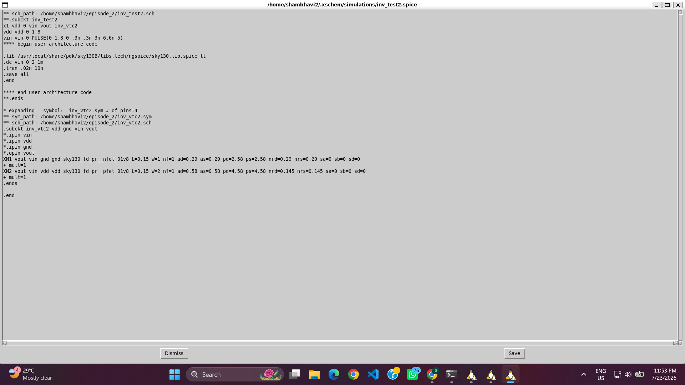
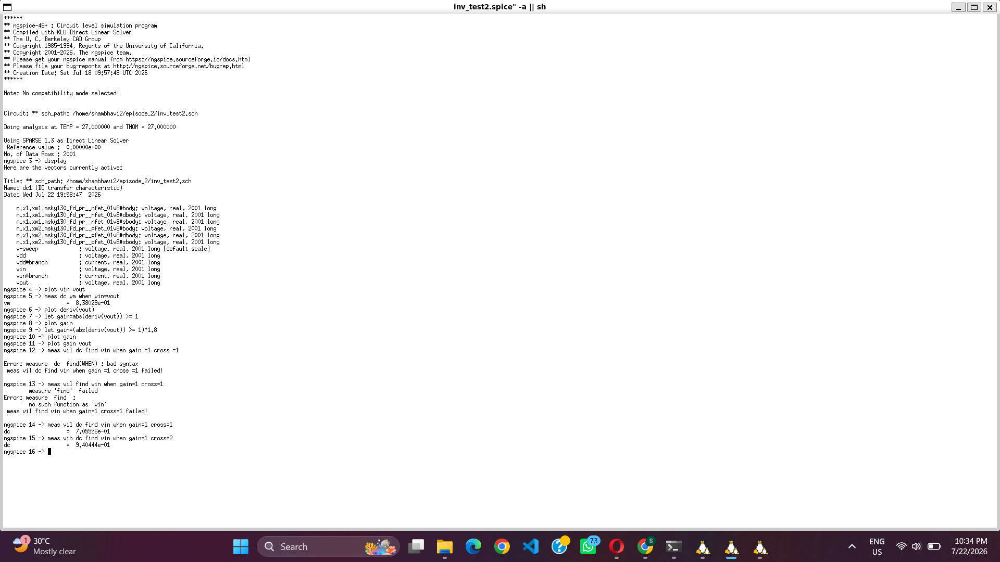
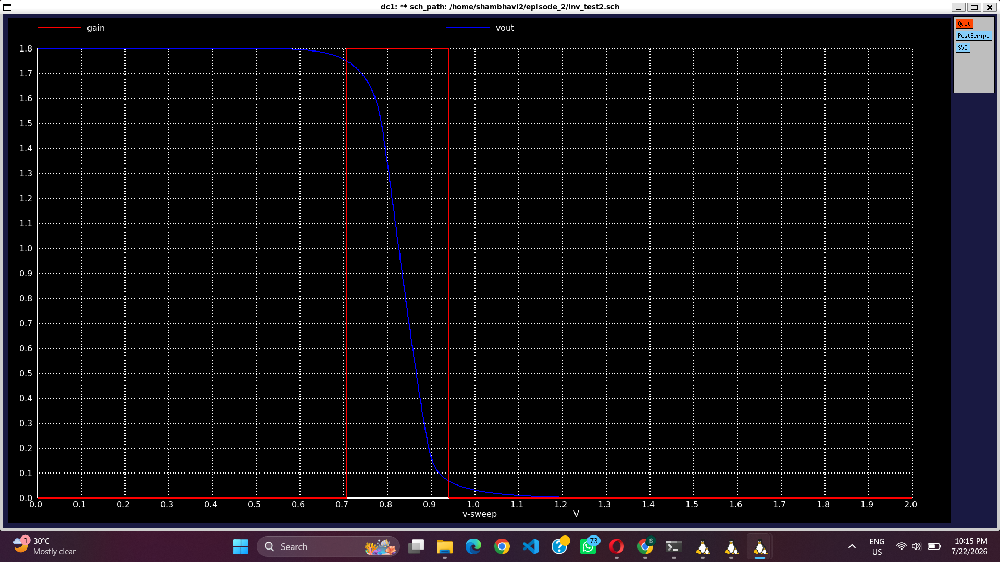

# 04 – CMOS Inverter Noise Margin Analysis

## Objective

This section is a continuation of **Part 03 – CMOS Inverter Voltage Transfer Characteristics (VTC)**. The VTC obtained in the previous experiment is used to calculate the gain curve and determine the **Noise Margins** of the CMOS inverter. Noise margin is an important performance parameter that indicates the immunity of a digital circuit against unwanted noise.

---

## Prerequisite

This experiment uses the same CMOS inverter schematic and testbench developed in **Part 03**. Only the simulation commands and post-processing in NgSpice are extended to calculate the gain curve and determine the values of **VIL**, **VIH**, **NML**, and **NMH**.

---

# Analysis Flow

## Step 1: Opening the Existing CMOS Inverter Testbench

The CMOS inverter project created in Part 03 was opened from the Ubuntu terminal. Since the schematic and testbench were already available, the existing design was reused for noise margin analysis.

<table>
<tr>
<td align="center">

**Opening the Project**


</td>
</tr>
</table>

---

## Step 2: Netlist Generation

After verifying the schematic connections, Xschem generated the SPICE netlist. The generated netlist contains all transistor models, power supplies, simulation commands, and circuit connectivity required by NgSpice.

<table>
<tr>
<td align="center">

**Generated Netlist**



</td>
</tr>
</table>

---

## Step 3: Running the Simulation

The DC sweep simulation was executed using NgSpice. The previously generated Voltage Transfer Characteristic (VTC) was used as the basis for further gain and noise margin calculations.

<table>
<tr>
<td align="center">

**Simulation Window**



</td>
</tr>
</table>

---

## Step 4: Plotting the Gain Curve

The gain of the CMOS inverter was calculated by taking the derivative of the output voltage with respect to the input voltage.

The following NgSpice commands were used:

```spice
plot derive(v(vout))

let gain = abs(derive(v(vout)))

plot gain
```

The gain curve identifies the region where the magnitude of the voltage gain exceeds unity.

<table>
<tr>
<td align="center">

**Gain Curve**


</td>
</tr>
</table>

---

## Step 5: Determining VIL and VIH

The points where the magnitude of the gain becomes equal to one were identified.

These voltages correspond to:

- **VIL** – Maximum input voltage recognized as Logic LOW.
- **VIH** – Minimum input voltage recognized as Logic HIGH.

These values define the valid operating region of the CMOS inverter.

<table>
<tr>
<td align="center">

**Gain Curve with VTC**



</td>
</tr>
</table>

---

## Step 6: Noise Margin Calculation

The values of **VIL** and **VIH** were obtained from the gain curve by identifying the points where the magnitude of the voltage gain became equal to one (|Gain| = 1). NgSpice was used to measure these values directly from the DC simulation.

The following commands were used:

```spice
plot derive(v(vout))

let gain = abs(derive(v(vout)))

plot gain

meas dc Vil when gain=1 cross=1

meas dc Vih when gain=1 cross=2
```

The simulation produced the following results:

| Parameter | Value |
|-----------|-------|
| **VIL** | **0.705556 V** |
| **VIH** | **0.940444 V** |
| **VOL** | **0 V** |
| **VOH** | **1.8 V** |

Using these values, the noise margins were calculated as:

### Low Noise Margin (NML)

\[
NML = VIL - VOL
\]

\[
NML = 0.705556 - 0
\]

\[
\boxed{NML = 0.705556\ V}
\]

### High Noise Margin (NMH)

\[
NMH = VOH - VIH
\]

\[
NMH = 1.8 - 0.940444
\]

\[
\boxed{NMH = 0.859556\ V}
\]

The calculated values indicate that the CMOS inverter has good immunity against input noise, with both logic HIGH and logic LOW regions providing adequate noise margins.

<p align="center">

<br>
<b>Figure 6.</b> NgSpice window showing the measured values of VIL and VIH used for noise margin calculation.
</p>

---

# Observation

- The Voltage Transfer Characteristic (VTC) obtained in **Part 03** was reused for the analysis.
- The gain curve was generated by differentiating the VTC using the `derive()` function in NgSpice.
- The critical switching voltages were obtained as:
  - **VIL = 0.705556 V**
  - **VIH = 0.940444 V**
- Using **VOL = 0 V** and **VOH = 1.8 V**, the calculated noise margins are:
  - **NML = 0.705556 V**
  - **NMH = 0.859556 V**
- The gain exceeds unity only within the switching region of the inverter, while outside this region the gain remains below one.
- The obtained noise margins indicate reliable switching behavior and good immunity against external noise.

---

# Conclusion

This experiment extends the Voltage Transfer Characteristic (VTC) analysis performed in **Part 03** by evaluating the noise margins of the CMOS inverter. The gain curve was analyzed to determine the critical switching voltages (**VIL** and **VIH**), and the corresponding **Low Noise Margin (NML = 0.705556 V)** and **High Noise Margin (NMH = 0.859556 V)** were calculated. These results confirm that the designed CMOS inverter provides stable logic operation with adequate tolerance to noise, making it suitable for reliable digital circuit applications.

---

# Conclusion

This experiment extends the Voltage Transfer Characteristic (VTC) analysis performed in **Part 03** by evaluating the noise margins of the CMOS inverter. The gain curve was analyzed to determine the critical switching voltages (**VIL** and **VIH**), and the corresponding **Low Noise Margin (NML)** and **High Noise Margin (NMH)** were calculated. These parameters are essential for assessing the reliability and robustness of CMOS digital circuits and form an important step in the complete CMOS inverter characterization workflow.
