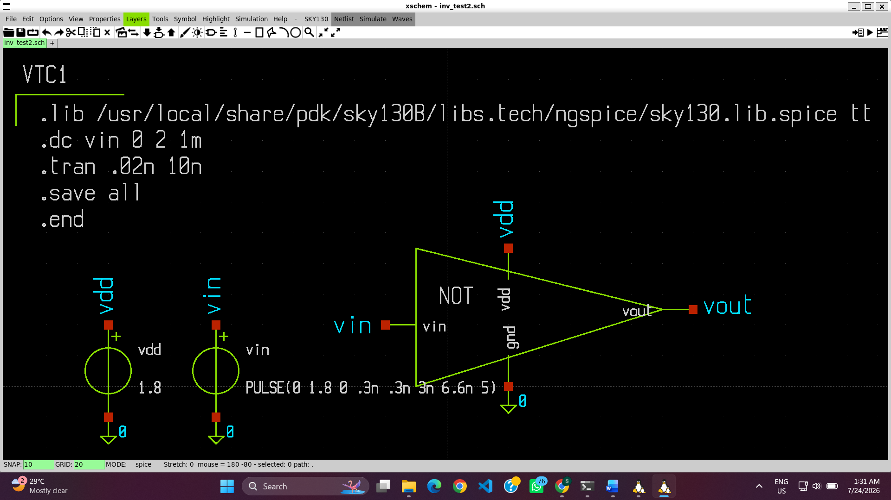
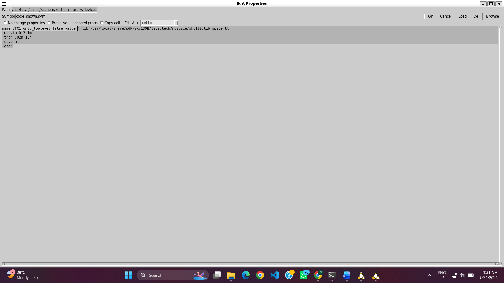
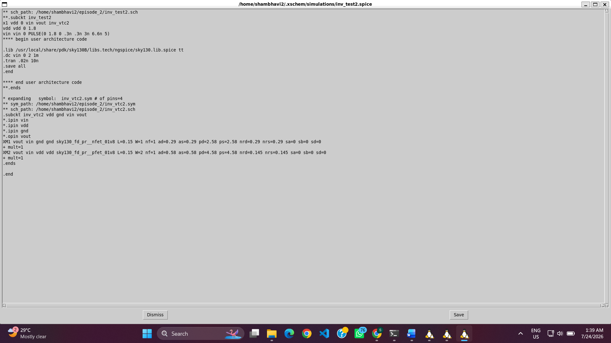
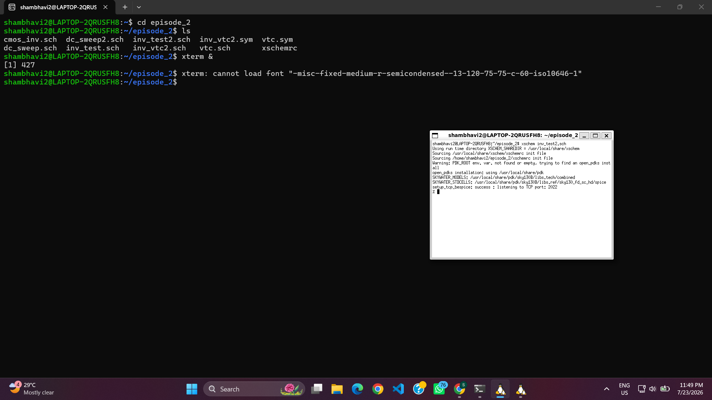
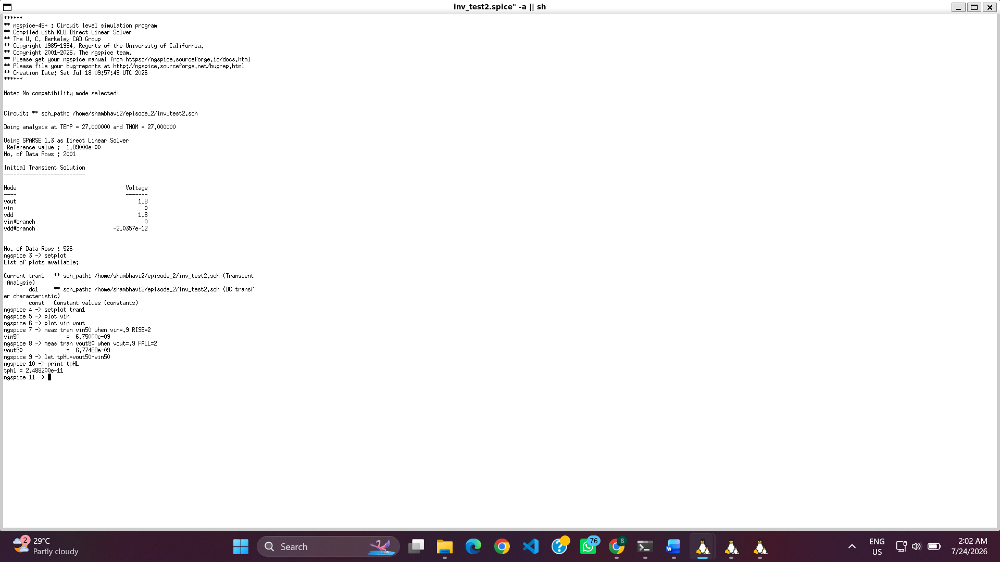
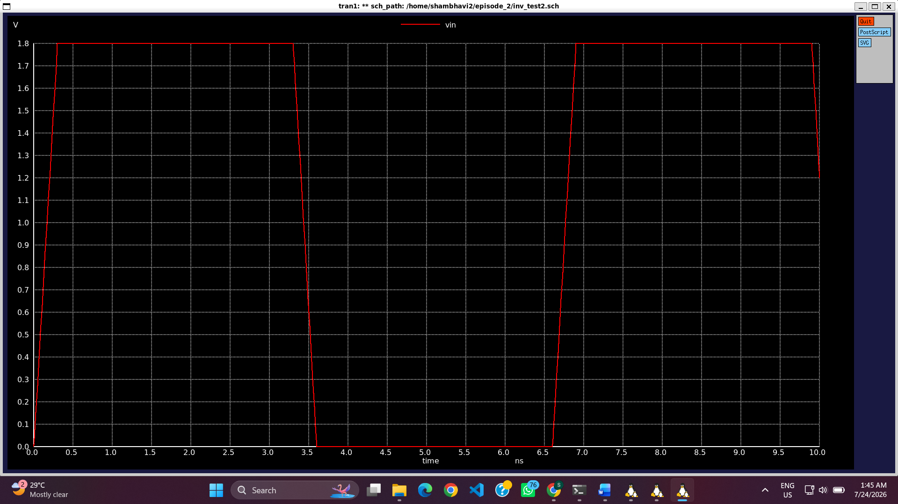

# 05 – CMOS Inverter Propagation Delay Analysis

## Objective

This experiment evaluates the **Propagation Delay** of the CMOS inverter using transient simulation in **Xschem** and **NgSpice**. Propagation delay represents the time required for the output to respond to a change in the input signal and is one of the most important timing parameters of digital circuits.

---

## Prerequisite

This experiment is a continuation of the CMOS inverter designed in the previous modules. The same inverter schematic is reused, while the simulation setup is modified to perform **Transient Analysis** using a pulse input source.

---

# Analysis Flow

## Step 1: Opening the Existing CMOS Inverter Design

The CMOS inverter schematic developed in the previous experiments was opened in Xschem. The same design was used for transient delay analysis.

<p align="center">

<br>
<b>Figure 1.</b> CMOS inverter schematic used for propagation delay analysis.
</p>

---

## Step 2: Configuring the Transient Simulation

The simulation code block was modified to perform transient analysis. The previous DC sweep command was replaced with a transient analysis command, and the input voltage source was configured as a pulse source.

The following pulse source was used:

```spice
PULSE(0 1.8 0 0.3n 0.3n 2.6n 6n)
```

The transient simulation command was added as:

```spice
.tran 0.02n 10n
```

### Editing the Input Source

<p align="center">

<br>
<b>Figure 2.</b> Configuring the pulse input source.
</p>

### Editing the Code Block

<p align="center">

<br>
<b>Figure 3.</b> Updating the simulation code block for transient analysis.
</p>

---

## Step 3: Netlist Generation

After verifying all schematic connections, Xschem generated the SPICE netlist required by NgSpice.

<p align="center">

<br>
<b>Figure 4.</b> Generated transient simulation netlist.
</p>

---

## Step 4: Running the Simulation

The transient simulation was executed successfully using NgSpice. The simulation generated the input and output voltage waveforms required for propagation delay measurement.

<p align="center">

<br>
<b>Figure 5.</b> Opening the design and launching the simulation.
</p>

<p align="center">

<br>
<b>Figure 6.</b> NgSpice transient simulation window.
</p>

---

## Step 5: Plotting the Waveforms

The transient response of the inverter was observed by plotting both the input and output voltages.

### Input Voltage

<p align="center">

<br>
<b>Figure 7.</b> Input pulse waveform.
</p>

### Output Voltage

<p align="center">

<br>
<b>Figure 8.</b> Output waveform showing the delayed response.
</p>

---

## Step 6: Propagation Delay Calculation

Propagation delay is measured between the **50% point of the input waveform** and the **50% point of the output waveform**.

The propagation delay is given by

\[
t_p = t_{OUT(50\%)} - t_{IN(50\%)}
\]

NgSpice measurement commands were used to determine these values.

The measured results are:

| Parameter | Measured Value |
|-----------|---------------:|
| Input reaches 50% (VIN = 0.9 V) | **6.75000 ns** |
| Output reaches 50% (VOUT = 0.9 V) | **6.77488 ns** |
| Propagation Delay (tPHL) | **24.88 ps** |

Thus,

\[
t_{PHL}=6.77488\;ns-6.75000\;ns
\]

\[
\boxed{t_{PHL}=24.88\;ps}
\]

The measured delay indicates that the CMOS inverter switches rapidly, making it suitable for high-speed digital applications.

<p align="center">

<br>
<b>Figure 9.</b> NgSpice window showing the measured timing values used for propagation delay calculation.
</p>

---

# Observation

- The simulation was changed from DC analysis to transient analysis.
- A pulse voltage source was applied at the inverter input.
- Both VIN and VOUT waveforms were plotted to observe switching behavior.
- The 50% voltage level (0.9 V) was used as the reference for delay measurement.
- The measured timing values are:
  - **VIN (50%) = 6.75000 ns**
  - **VOUT (50%) = 6.77488 ns**
- The calculated propagation delay is:

  **tPHL = 24.88 ps**

- The small propagation delay demonstrates the fast switching capability of the CMOS inverter.

---

# Conclusion

The propagation delay of the CMOS inverter was successfully evaluated using transient simulation in NgSpice. A pulse input source was applied to the inverter, and the corresponding output response was analyzed. Using the 50% voltage crossing points of the input and output waveforms, the propagation delay was calculated to be **24.88 ps**. This result confirms the high-speed switching performance of the CMOS inverter and completes another important stage in the characterization of the Sky130 CMOS inverter.
