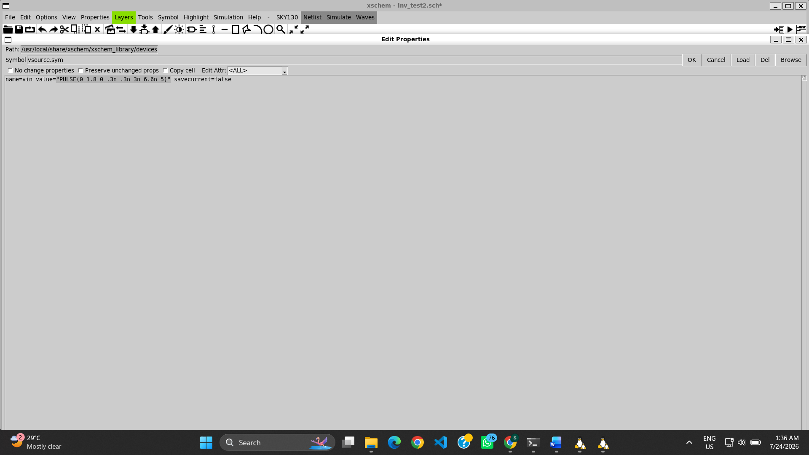

# 05 – CMOS Inverter Propagation Delay Analysis

## Objective

This experiment performs **Propagation Delay Analysis** of the CMOS inverter using **Transient Simulation** in **Xschem** and **NgSpice**.

Unlike the previous experiments that focused on the DC characteristics of the inverter, this section analyzes the switching speed by measuring the time required for the output to respond to a change in the input signal.

Propagation delay is one of the most important timing parameters of CMOS digital circuits and determines the maximum operating speed of the inverter.

---

## Prerequisite

This experiment is a direct continuation of the previous modules.

- **Part 03:** CMOS Inverter Voltage Transfer Characteristics (VTC)
- **Part 04:** CMOS Inverter Noise Margin Analysis

The same CMOS inverter schematic and testbench created previously are reused. Only the simulation setup is modified to perform **Transient Analysis** for propagation delay measurement.

---

# Analysis Flow

## Step 1: Opening the Existing Project

The existing CMOS inverter project developed in the previous modules was opened from the Ubuntu terminal. Xterm was launched first, followed by Xschem, to continue working with the previously created schematic and testbench.

<p align="center">

<br>
<b>Figure 1.</b> Ubuntu terminal and Xterm commands used to open the existing CMOS inverter project.
</p>

---

## Step 2: Opening the Existing CMOS Inverter Schematic

The CMOS inverter schematic designed during the earlier experiments was reused without modifying the transistor dimensions or circuit connections.

<p align="center">

<br>
<b>Figure 2.</b> CMOS inverter schematic reused for propagation delay analysis.
</p>

---

## Step 3: Configuring the Transient Simulation

Since propagation delay is a time-domain parameter, the DC simulation used previously was replaced with **Transient Analysis**.

### Editing the Input Source

The DC input source was replaced with a pulse source.

```spice
PULSE(0 1.8 0 0.3n 0.3n 2.6n 6n)
```

<p align="center">

<br>
<b>Figure 3.</b> Editing the input source to generate a pulse waveform.
</p>

### Editing the Simulation Code Block

The code block was updated by replacing the previous `.dc` command with the transient analysis command.

```spice
.tran 0.02n 10n
```

<p align="center">

<br>
<b>Figure 4.</b> Updating the code block for transient simulation.
</p>

---

## Step 4: Netlist Generation

After verifying the schematic, Xschem generated the SPICE netlist containing the CMOS inverter circuit, transistor models, pulse source definition, and transient simulation commands required by NgSpice.

<p align="center">

<br>
<b>Figure 5.</b> Generated SPICE netlist for transient simulation.
</p>

---

## Step 5: Running the Simulation

The generated netlist was simulated using NgSpice. The transient simulation successfully produced the switching response of the CMOS inverter.

<p align="center">

<br>
<b>Figure 6.</b> NgSpice transient simulation window.
</p>

---

## Step 6: Plotting the Input and Output Waveforms

The transient response was visualized by plotting both the input voltage (**VIN**) and output voltage (**VOUT**).

### Input Waveform

<p align="center">

<br>
<b>Figure 7.</b> Input pulse waveform.
</p>

### Output Waveform

<p align="center">

<br>
<b>Figure 8.</b> Output waveform showing the delayed inverter response.
</p>

---

## Step 7: Propagation Delay Calculation

Propagation delay is defined as the time difference between the **50% voltage point of the input waveform** and the **50% voltage point of the output waveform**.

The delay is calculated using

\[
t_p = t_{OUT(50\%)} - t_{IN(50\%)}
\]

where

- \(t_{IN(50\%)}\) = Time when **VIN = 0.9 V**
- \(t_{OUT(50\%)}\) = Time when **VOUT = 0.9 V**

NgSpice measurement commands were used to determine these values.

The measured values obtained from the simulation are:

| Parameter | Value |
|-----------|-------:|
| Input reaches 50% (VIN = 0.9 V) | **6.75000 ns** |
| Output reaches 50% (VOUT = 0.9 V) | **6.77488 ns** |
| Propagation Delay (tPHL) | **24.88 ps** |

Therefore,

\[
t_{PHL}=6.77488\ ns-6.75000\ ns
\]

\[
\boxed{t_{PHL}=24.88\ ps}
\]

The small propagation delay indicates that the CMOS inverter switches rapidly and is suitable for high-speed digital applications.

<p align="center">

<br>
<b>Figure 9.</b> NgSpice window showing the measured values used for propagation delay calculation.
</p>

---

# Observation

- This experiment is a continuation of the CMOS inverter characterization performed in **Parts 03 and 04**.
- The existing CMOS inverter schematic was reused without modifying the circuit topology.
- The simulation was changed from **DC Analysis** to **Transient Analysis**.
- A pulse input source was used to switch the inverter between logic LOW and logic HIGH.
- The transient response clearly shows that the output changes after a finite delay with respect to the input.
- The measured timing values are:
  - **VIN (50%) = 6.75000 ns**
  - **VOUT (50%) = 6.77488 ns**
- The calculated propagation delay is:
  - **tPHL = 24.88 ps**
- The obtained delay demonstrates the fast switching capability of the CMOS inverter implemented using the Sky130 PDK.

---

# Conclusion

This experiment extends the CMOS inverter characterization performed in **Part 03 (Voltage Transfer Characteristics)** and **Part 04 (Noise Margin Analysis)** by evaluating the transient switching performance of the inverter.

Using transient simulation in NgSpice, the input and output waveforms were analyzed, and the propagation delay was calculated from the 50% voltage crossing points. The measured propagation delay of **24.88 ps** confirms that the designed CMOS inverter exhibits fast switching characteristics, making it suitable for high-speed CMOS digital circuits.

Propagation delay analysis completes another important stage in the pre-layout characterization of the Sky130 CMOS inverter before moving toward power analysis and physical layout.
